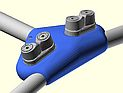

# blokart_stuff
This repository contains blokart accessories that I am releasing to the public. Please note, these are NOT open-source; check the [License file](LICENSE).

## blokartPodLightStrips

[This directory](blokartPodLightStrips) contains Arduino code for the ATtiny85 chip to run LED strips attached to the port and stabord sides of the POD for better visibilty (to others) in low-light conditions.

## blokart-handlebar-cleat-mount
[This directory](blokart-handlebar-cleat-mount) contains the design for a dual micro cam-cleat mount that clips to the blokart handlebar.

