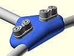
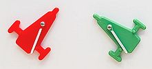

# blokart_stuff
This repository contains blokart accessories that I am releasing to the public. 

__Please note:__ these are NOT open-source; check the [License file](LICENSE).

## Designs in this directory:

### Kong-Style_quick_release_spacer.scad
A design for a spacer to keep the downhaul shackle centered in a Kong snap-shackle.

### Pully Whip Plug.scad.scad
A design for the plug that goes in the end of the puiley whip to use when you need one urgently. __NOTE:__ this is not legal for racing under IBRA rules.

## Design Directories:

### blokartPodLightStrips
[This directory](blokartPodLightStrips) contains Arduino code for the ATtiny85 chip to run LED strips attached to the port and stabord sides of the POD for better visibilty (to others) in low-light conditions.

### blokart-handlebar-cleat-mount
[This directory](blokart-handlebar-cleat-mount) contains the design for a dual micro cam-cleat mount that clips to the blokart handlebar.

### blokart-pulley-whip-drill-guide
[This directory](blokart-pulley-whip-drill-guide) contains the design for a jig to sand the end of a pulley-while tube square and drill holes for the spring-pin and plug.

### blokart-whiteboard-pieces
[This directory](blokart-whiteboard-pieces) contains the designs for magnetic blokart tokens to use for rules and tactics discussions.

### ThreeButtonKitchenTimerHandlebarMount
[This directory](ThreeButtonKitchenTimerHandlebarMount) contains a work-in-progress design to mount a common, inexpensive kitchen timer to the blokart handlebar.